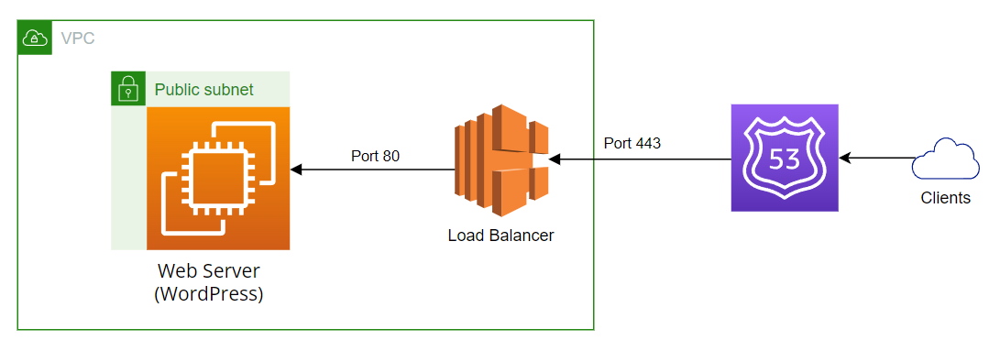

# flowing-middle-test (by Riccardo Bruè)

In this repository we can find a full working sample for deploying WordPress to a EC2 instance.

## AWS architecture

Required services:

- **EC2** instance: Where Wordpress website will run through *Apache* web server and a local MySQL database (for demo purposes only, this could be created also on a separate RDS resource);

- **SecurityGroup**: Enables the HTTP access via port 80 and the SSH access on port 22.

- **VPC** and VPC subnets: It creates a VPS and subnets in *eu-west-1a* and *eu-west-1b* areas;

- **ElasticLoadBalancingV2**: In order to accomplish with the fault-tolerance requirement (subnets) and adaptiveness to load.



### Design notes

The following rationales have been made in order to create the required architecture:

- The load balancer implementation has been made in order to have:
  
  - Adaptive to average load (in this example only one EC2 instance has been used, if two instances were used it would have performed this requirement);
  
  - Forwarding requests from 443 /HTTPS protocol) to EC2 port 80 where WordPress is running. SO the usage of the SSL certificate here offers the security requirement;

- There are two subnets because it is required by the load balancer, in this sample only one is used with the EC2 instance;

- There is a local MySQL database inside the EC2 instance for simplicity;

## Pre-requirements and parameters

In order to go ahead with the initialization of the project, you should create the following preliminaries:

- **KeyName**: Name of an existing EC2 KeyPair to enable SSH access to the instances, you can create a new key pair download a .pem file on the AWS EC2 management console.

- **SSLCertARN**: The existing SSL/TLS certificate ARN in order to enable HTTPS protocol. This can be created using the *AWS Certificate Manager*.

- **HostedZoneId**: The ID of the existing hosted zone

The parameters file contenta sample should look like this and have the same parameters keys.

```json
[  
{    "ParameterKey": "DBName",    "ParameterValue": "sample_dbname"  },  
{    "ParameterKey": "DBPassword",    "ParameterValue": "sample_dbpassword"  },  
{    "ParameterKey": "DBUsername",    "ParameterValue": "sampe_dbuser"  },  
{    "ParameterKey": "EC2InstanceType",    "ParameterValue": "t1.micro"  },  
{    "ParameterKey": "WordPressVersion",    "ParameterValue": "5.8"  },  
{    "ParameterKey": "KeyName",    "ParameterValue": "existing_ssh_key_name"  },  
{    "ParameterKey": "SSLCertARN",    "ParameterValue": "existing_ssl_key_arn"  },
{    "ParameterKey": "HostedZoneId",    "ParameterValue": "existing_zone_id"  }
]
```

## Installation instruction

We are going to use CloudFormation to automate the cloud infrastructure creation. At this point, there should be a configured AWS CLI console ready to be used, if not, please execute the `aws configure` command first.

In order to start the stack creation, execute the following command in the cli:

```shell
#CREATE:
aws cloudformation create-stack --stack-name "demo-flowing-wordpress-test" --template-body "file://template.yaml" --parameters "file://parameters-file.json"


#DELETE: 
aws cloudformation delete-stack --stack-name "demo-flowing-wordpress-test"


#UPDATE:
aws cloudformation update-stack --stack-name "demo-flowing-wordpress-test" --template-body "file://template.yaml" --parameters "file://parameters-file.json"
```

## User guide

Once the stack creation has completed, the WordPress will be deployed into a EC2 instance reachable by the Internet fromt he used domain name used from the used  *SSLCertARN*.

## 

## Missing requirements

The CI/CD requirement is missing because is would require pipelines, this technology is still not known very well and it has been preferred to avoid adding it into this test.

## References

The base WorPress templates used as reference are available here:

- https://s3.eu-west-1.amazonaws.com/cloudformation-templates-eu-west-1/WordPress_Single_Instance.template

- https://s3.eu-west-1.amazonaws.com/cloudformation-templates-eu-west-1/WordPress_Multi_AZ.template

Automating the SSH key pair creation:

- https://docs.aws.amazon.com/AWSEC2/latest/UserGuide/create-key-pairs.html

HTTPS:

- https://docs.aws.amazon.com/it_it/elasticloadbalancing/latest/classic/elb-add-or-delete-listeners.html